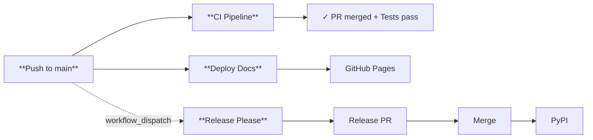
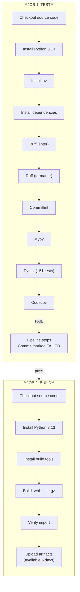
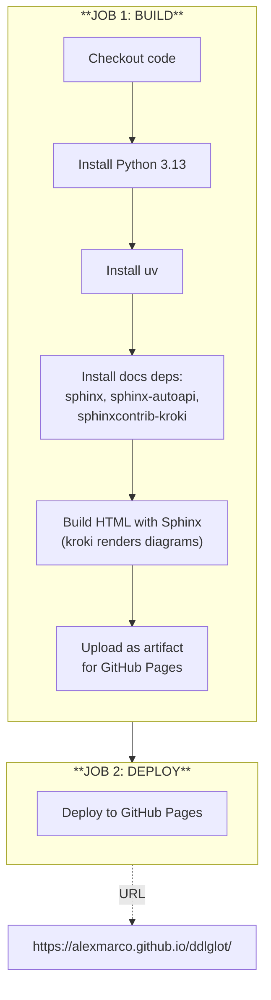
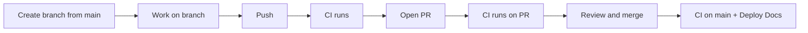
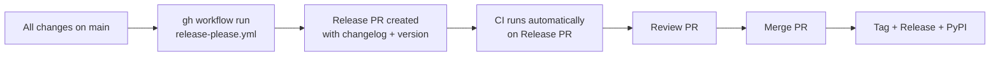

# CI/CD Architecture

This document describes the continuous integration and deployment (CI/CD) architecture of the ddlglot project. It is designed so that any developer, even without prior CI/CD experience, can understand how the system works and when each part is executed.

---

## 1. Overview

The ddlglot project has **3 pipelines** (workflows) that run independently:

| Pipeline | Purpose | When it runs |
|----------|---------|--------------|
| **CI** | Validate code (tests, lint, type checking) | On every push and PR |
| **Deploy Docs** | Build and publish documentation | On every push to main |
| **Release Please** | Manage releases and publish to PyPI | Manual only |



---

## 2. CI Pipeline (Code Validation)

The CI pipeline is the most important one and runs **frequently**. Its goal is to ensure code meets quality standards before merging.

### 2.1. When it runs

| Event | Runs |
|-------|------|
| Push to `main` or `develop` | Yes |
| Any Pull Request | Yes |
| Manual execution | Yes |

### 2.2. Pipeline phases

The CI pipeline has **2 jobs** that run sequentially:



### 2.3. What each tool checks

| Tool | What it checks | Blocks merge |
|------|----------------|--------------|
| **Ruff** (check) | Code style (imports, naming, etc.) | Yes |
| **Ruff** (format) | Code formatting | Yes |
| **Commitlint** | Commit messages follow Conventional Commits | Yes |
| **Mypy** | Type errors (not warnings) | Errors only |
| **Pytest** | All tests pass | Yes |

---

## 3. Deploy Docs Pipeline (Documentation)

This pipeline builds the Sphinx documentation and publishes it to GitHub Pages.

### 3.1. When it runs

| Event | Runs |
|-------|------|
| Push to `main` | Yes |
| Manual execution | Yes |
| PRs | No |
| Other branches | No |

**Important**: It only runs on pushes to the `main` branch.

### 3.2. Pipeline phases



### 3.3. Features

- **Concurrency**: If another deployment is in progress, it does not cancel.
- **Dynamic version**: The version is read automatically from `pyproject.toml`.
- **sphinx-autoapi**: The API reference is generated automatically from the source code.
- **sphinxcontrib-kroki**: Diagrams are rendered via kroki.io at build time.

---

## 4. Release Please Pipeline (Releases and PyPI)

This pipeline manages semantic versions and publishes the package to PyPI.

### 4.1. When it runs

| Event | Runs |
|-------|------|
| Manual execution (`workflow_dispatch`) | Yes |
| Push to `main` | No (manual-only) |

### 4.2. Pipeline phases

```mermaid
flowchart TB
    subgraph RP["**JOB 1: RELEASE-PLEASE**"]
        direction TB
        A1["Checkout code"] --> A2["Run Release Please"]
        A2 --> A3["Analyze commits since last version"]
        A3 --> A4["Determine change type\n(major/minor/patch)"]
        A4 --> A5["Create or update\nRelease PR"]
        A5 --> OUTPUTS["**Outputs**\nreleases_created: true/false\nversion: \"0.3.0\"\nsha: commit-hash"]
    end

    RP -.->|"releases_created = true"| PUB

    subgraph PUB["**JOB 2: PUBLISH**"]
        direction TB
        B1["Checkout at tag commit"] --> B2["Install Python 3.13"]
        B2 --> B3["Install uv"]
        B3 --> B4["Build package"]
        B4 --> B5["Publish to PyPI\n(Trusted Publisher)"]
    end
```

### 4.3. How Release Please works

Release Please automates semantic versioning based on commit messages.

**Complete flow**:

```mermaid
flowchart LR
    A["**1.** Developer makes a\nConventional Commit:\n\"feat(builder): add DDL inspection\""] --> B["**2.** Push to main\n(via regular PR merge)"]
    B --> C["**3.** Run Release Please:\ngh workflow run release-please.yml"]
    C --> D["**4.** Release Please detects\n\"feat:\" (new feature)"]
    D --> E["**5.** Creates Release PR:\n\"chore: release 0.3.0\"\n- Changelog\n- Calculated version"]
    E --> F["**6.** CI runs automatically\non the Release PR"]
    F --> G["**7.** Review and merge PR"]
    G --> H["**8.** GitHub creates\ntag (v0.3.0) +\nGitHub Release"]
    H --> I["**9.** PUBLISH job\npublishes to PyPI"]
```

**Change types based on Conventional Commits**:

| Prefix | Change type | Version example |
|--------|-------------|-----------------|
| `feat:` | New functionality | 0.1.0 → 0.2.0 |
| `fix:` | Bug fix | 0.1.0 → 0.1.1 |
| `docs:` | Documentation | No version change |
| `ci:` | CI/CD changes | No version change |

### 4.4. Important: No automatic releases

Release Please **does not publish automatically**. It only creates the Release PR. You decide when to merge and publish.

---

## 5. Trigger Summary

| Action | CI | Deploy Docs | Release Please |
|--------|----|------------|----------------|
| Push to `main` | Yes | Yes | No (manual-only) |
| Push to `develop` | Yes | No | No |
| Push to other branch | No | No | No |
| PR to `main` or `develop` | Yes | No | No |
| Any other PR | Yes | No | No |
| Manual execution | Yes | Yes | Yes |

---

## 6. Common Use Cases

### 6.1. Normal change (bugfix, feature, docs)



1. Create branch from `main`
2. Work on the branch
3. Push → CI runs
4. Open PR → CI runs on the PR
5. Review and merge
6. CI runs on `main` (post-merge)
7. Deploy Docs runs automatically

### 6.2. Update documentation

1. Make changes in `docs/`
2. Push to `main` (via PR)
3. Deploy Docs runs automatically
4. Verify at https://alexmarco.github.io/ddlglot/

### 6.3. Make a release



1. Ensure all desired changes are on `main`
2. Trigger Release Please manually: `gh workflow run release-please.yml`
3. Release Please creates a PR with changelog and version
4. CI runs automatically on the Release PR (no manual trigger needed)
5. Review the PR
6. Merge the PR → tag + GitHub Release + PyPI publish

---

## 7. GitHub Pages Configuration

| Setting | Value |
|---------|-------|
| URL | https://alexmarco.github.io/ddlglot/ |
| Source | Generated automatically by GitHub |
| Build tool | Sphinx |
| Theme | sphinx_book_theme |
| Version | Read dynamically from `pyproject.toml` |

---

## 8. Trusted Publisher (PyPI)

The project uses PyPI Trusted Publisher, which means:

- No PyPI API token in secrets is needed
- Publishing uses OIDC (OpenID Connect)
- Only the Release Please workflow can publish
- The environment is named `pypi`

---

## 9. Permissions and Security

| Workflow | contents | pages | pull-requests | id-token |
|----------|----------|-------|---------------|----------|
| CI | read | - | - | - |
| Docs | read | write | - | write |
| Release | write | - | write | write |

| Permission | Meaning |
|------------|---------|
| **contents** | Read/edit repo content |
| **pages** | Deploy to GitHub Pages |
| **pull-requests** | Create/edit PRs |
| **id-token** | OIDC authentication for PyPI |

---

## 10. FAQ

**Can I run a workflow manually?**

Yes, all workflows have `workflow_dispatch`. You can run them from the "Actions" tab on GitHub.

**What happens if CI fails?**

The commit/PR is marked as failed (red). Merge is blocked until all checks pass.

**How long does CI take?**

Approximately 1-2 minutes.

**Can I push directly to main?**

Technically yes (because you are the owner), but **you should not**. Always create a PR.

**When does PyPI publish happen?**

Only when the Release PR created by Release Please is merged.

**What is the "Release PR"?**

It is a special PR created by Release Please that contains:

- Changelog of changes since the last version
- Automatically calculated new version
- Label `autorelease: pending`

**Does Release Please publish automatically?**

No. It only creates the PR. You decide when to merge.

---

## 11. Glossary

| Term | Meaning |
|------|---------|
| **Pipeline** | Automated flow of tasks in GitHub Actions |
| **Job** | Set of steps that run on one machine |
| **Step** | Individual task (e.g., "Run tests") |
| **Artifact** | Generated files that can be downloaded |
| **Workflow** | YAML file that defines a pipeline |
| **Trusted Publisher** | PyPI authentication without tokens |
| **Conventional Commits** | Commit message format (feat:, fix:, etc.) |
| **Release PR** | Special PR created by Release Please |
| **Semantic Versioning** | Versioning as major.minor.patch |
| **OIDC** | Authentication protocol for publishing |
| **Mermaid** | Diagram rendering in Markdown (github.com/mermaid) |
| **Kroki** | Diagram rendering service for Sphinx docs (kroki.io) |
